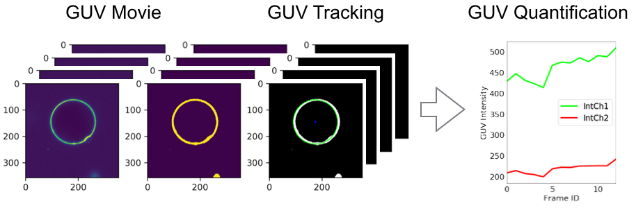

# GUV Tracking Quantification

A Jupyter notebook to track and quantify GUVs.

Input: GUV movie
Processing: Track the GUV for every frame and every channel
Output: The fluorescence intensity of the GUV membrane

## About

I wrote the code 2017/2018 to quantify fluorescence intensity of the membrane and of proteins binding/bound to the membrane over time.
Input is a tif-stack of a microscopy image series of a giant unilamellar vesicle (GUV)).
For every frame, the vesicle is found, traced and the fluorscence intensity in every channel reported along the membrane.
Further reading and additional science on http://www.schoeneberglab.org

## FAQ

What is a GUV?
A GUV is a giant unilamellar vesicle
https://en.wikipedia.org/wiki/Model_lipid_bilayer

## References

- scikit http://scikit-image.org
- OpenCV https://opencv.org
- The Hurley Lab http://membrane.berkeley.edu
